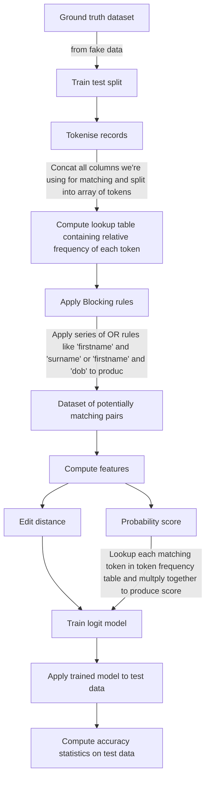

# Sample AWS Glue script for data linking

A first attempt at a Glue job that performs data deduplication.

High level overview of the job (use VS Code Markdown Preview Enhanced to view).

## Further details

You can find a full example with output dataframes at each stage [here](https://github.com/moj-analytical-services/data_linking_glue_job_test/blob/master/match/step_by_step_example.ipynb)